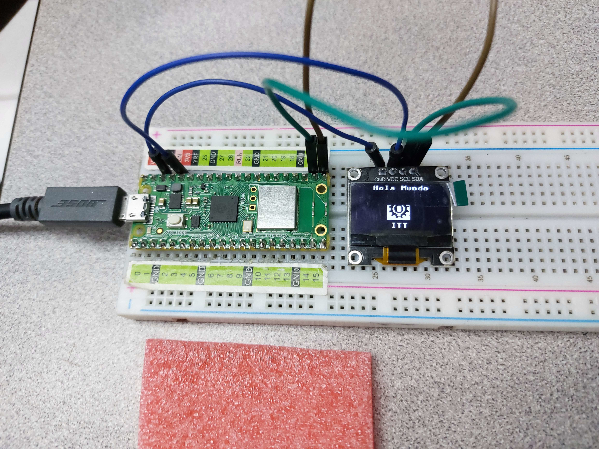

Para el desarrollo de esta practica se hizo uso de la libreria ssd1306, que permite controlar el display oled.<br>
La libreria se puede encontrar [aquí](https://github.com/stlehmann/micropython-ssd1306/blob/master/ssd1306.py)

# Hola mundo


# Código de Micropython
```python
from machine import Pin, I2C
from ssd1306 import SSD1306_I2C
import framebuf, sys

pix_res_x = 128
pix_res_y = 64

def init_i2c(scl_pin, sda_pin):
    # Initialize I2C device
    i2c_dev = I2C(1, scl=Pin(scl_pin), sda=Pin(sda_pin), freq=200000)
    i2c_addr = [hex(ii) for ii in i2c_dev.scan()]
    
    if not i2c_addr:
        print('No I2C Display Found')
        sys.exit()
    else:
        print("I2C Address      : {}".format(i2c_addr[0]))
        print("I2C Configuration: {}".format(i2c_dev))
    
    return i2c_dev

def display_logo(oled):
    # Display the Raspberry Pi logo on the OLED
    buffer = bytearray(
        [
            0xff, 0xff, 0xff, 0xff, 0xff, 0xf3, 0xe7, 0xff, 0xff, 0xf1, 0xc7, 0xff, 0xff, 0xf0, 0x07, 0xff, 
            0xfe, 0xf0, 0x03, 0x9f, 0xfc, 0x00, 0x00, 0x1f, 0xfc, 0x00, 0x80, 0x1f, 0xfe, 0x07, 0xf8, 0x3f, 
            0xfe, 0x1c, 0x0c, 0x3f, 0xfc, 0x30, 0x06, 0x1f, 0xe0, 0x21, 0xe3, 0x01, 0xe0, 0x63, 0xf1, 0x01, 
            0xe0, 0x43, 0xf1, 0x87, 0xf8, 0xc3, 0xf1, 0x8f, 0xf8, 0xc3, 0xf1, 0x8f, 0xf8, 0xc3, 0xf1, 0x8f, 
            0xf8, 0x43, 0xf1, 0x83, 0xe0, 0x63, 0xf1, 0x01, 0xe0, 0x61, 0xe3, 0x01, 0xe4, 0x30, 0x06, 0x1f, 
            0xfe, 0x1c, 0x0c, 0x1f, 0xfe, 0x07, 0xf8, 0x3f, 0xfe, 0x01, 0xe0, 0x1f, 0xfc, 0x03, 0xe0, 0x0f, 
            0xfc, 0x63, 0xe3, 0x9e, 0xff, 0xf0, 0x07, 0xff, 0xff, 0xf1, 0xe3, 0xff, 0xff, 0xf1, 0xe3, 0xff, 
            0xff, 0xff, 0xff, 0xff, 0xff, 0xff, 0xff, 0xff, 0xff, 0xff, 0xff, 0xff, 0x00, 0x00, 0x00, 0x00
        ]
    )
    fb = framebuf.FrameBuffer(buffer, 32, 32, framebuf.MONO_HLSB)
    
    oled.fill(0)
    oled.blit(fb, 45, 15)
    oled.show()

def display_text(oled):
    # Display text on the OLED
    oled.text("Hola mundo", 23, 0)
    oled.text("ITT", 50, 50)
    oled.show()

def main():
    i2c_dev = init_i2c(scl_pin=27, sda_pin=26)
    oled = SSD1306_I2C(pix_res_x, pix_res_y, i2c_dev)
    display_logo(oled)
    display_text(oled)

if __name__ == '__main__':
    main()
```
