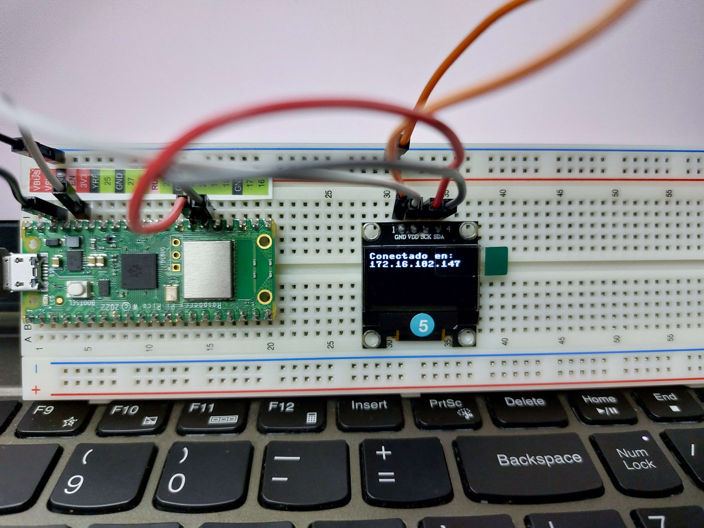
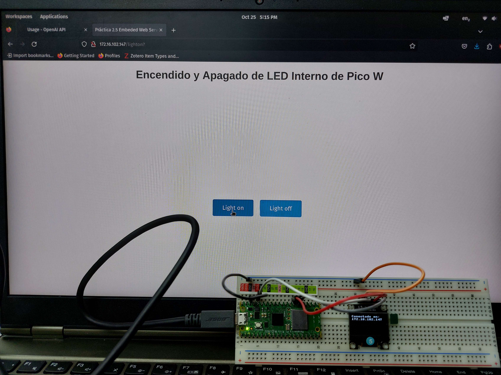
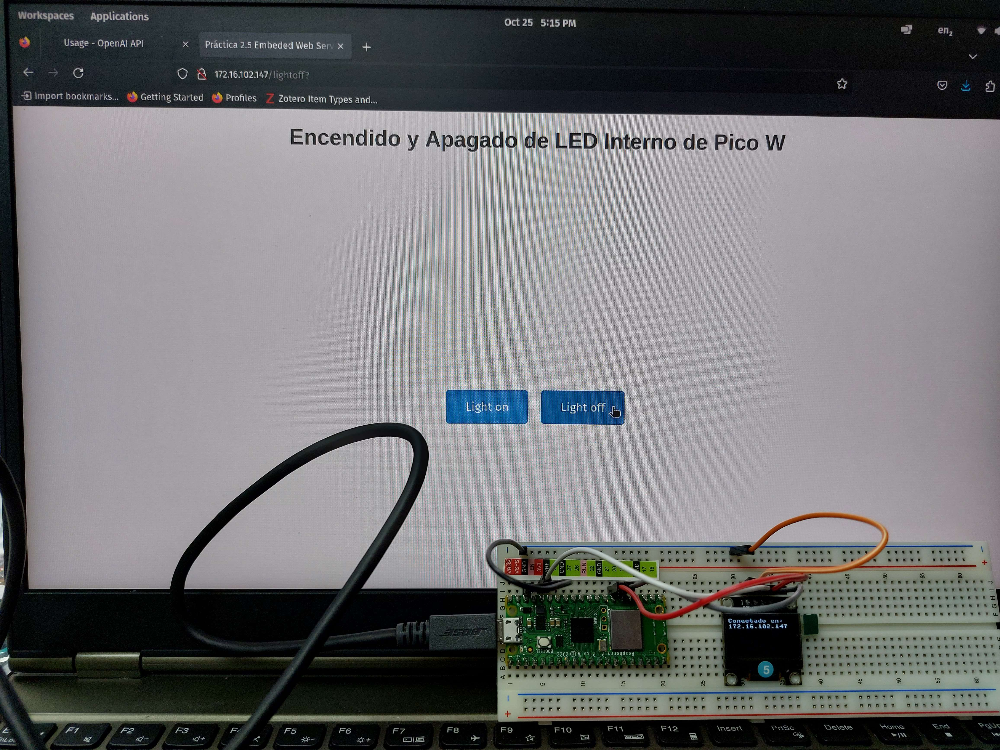

# Solución




# Codigo
Primero se encuentra el codigo principal, que se ejecuta en la Pico W.

```python
import network
import socket
from time import sleep
from machine import Pin, I2C
from ssd1306 import SSD1306_I2C
import images
import framebuf, sys

ssid = 'TecNM-ITT-Docentes'
password = 'tecnm2022!'
led = Pin("LED", Pin.OUT)
pix_res_x = 128
pix_res_y = 64
i2c = I2C(0, scl=Pin(21), sda=Pin(20))
oled = SSD1306_I2C(pix_res_x, pix_res_y, i2c)

def connect():
    max_wait = 0
    #Connect to WLAN
    wlan = network.WLAN(network.STA_IF)
    wlan.active(True)
    wlan.connect(ssid, password)
    while max_wait <= 10:
        oled.text('Conectando...', 0, 0)
        #displayImg(oled,images.wifiConnectionH, 32, 32, 20, 20)
        #displayImg(oled,images.wifiConnectionF, 32, 32, 20, 20)
        sleep(2)
        max_wait += 1
    if max_wait == 10:
        oled.fill_rect(0, 0, 104, 8, 0)
        oled.text("No Conexion", 0, 0)
        displayImg(oled, images.wifiFailed, 32, 32, 20, 20)
    ip = wlan.ifconfig()[0]
    oled.fill_rect(0, 0, 104, 8, 0)
    oled.text("Conectado en:", 0, 0)
    oled.text(str(ip), 0, 10)
    oled.show()
    return ip

def open_socket(ip):
    address = (ip, 80)
    connection = socket.socket()
    connection.setsockopt(socket.SOL_SOCKET, socket.SO_REUSEADDR, 1)
    connection.bind(address)
    connection.listen(1)
    return connection

def close_socket(connection):
    connection.close()

def web_page():
    page = open("index.html", "r")
    html = page.read()
    page.close()
    return str(html)

def serve(connection):
    led.off()
    while True:
        client = connection.accept()[0]
        try:
            request = client.recv(1024)
            request = str(request)
            print(request)
            try:
                request = request.split()[1]
            except IndexError:
                pass
            if request == '/lighton?':
                led.on()
            elif request == '/lightoff?':
                led.off()
            html = web_page()
            client.send(html)
        finally:
            client.close()

def displayImg(oled, IMGname, resX, resY, posX, posY):
    IMG = framebuf.FrameBuffer(IMGname, resX, resY, framebuf.MONO_HLSB)
    oled.blit(IMG, posX, posY)
    oled.show()

def main():
    try:
        ip = connect()
        connection = open_socket(ip)
        serve(connection)
    except KeyboardInterrupt:
        connection.close()

if __name__ == '__main__':
    main()
```

Luego contamos con el archivo donde se guardan lo bytearrays de la imagenes utilizadas.

```python
ledOn = bytearray([0x00, 0x11, 0x10, 0x00, 0x01, 0x89, 0x23, 0x00, 0x00, 0xc5, 0x46, 0x00, 0x00, 0x60, 0x0c, 0x00,
0x00, 0x07, 0xc0, 0x00, 0x03, 0x8f, 0xe3, 0x80, 0x00, 0x1f, 0xf0, 0x00, 0x00, 0x1f, 0xf0, 0x00,
0x00, 0x1f, 0xf0, 0x00, 0x00, 0x1f, 0xf0, 0x00, 0x00, 0x1f, 0xf0, 0x00, 0x00, 0x1f, 0xf0, 0x00,
0x00, 0x1f, 0xf0, 0x00, 0x00, 0x1f, 0xf0, 0x00, 0x00, 0x1f, 0xf0, 0x00, 0x00, 0x1f, 0xf0, 0x00,
0x00, 0x1f, 0xf0, 0x00, 0x00, 0x1f, 0xf0, 0x00, 0x00, 0x1f, 0xf0, 0x00, 0x00, 0x1f, 0xf0, 0x00,
0x00, 0x04, 0x40, 0x00, 0x00, 0x04, 0x40, 0x00, 0x00, 0x04, 0x40, 0x00, 0x00, 0x04, 0x40, 0x00,
0x00, 0x04, 0x40, 0x00, 0x00, 0x04, 0x40, 0x00, 0x00, 0x04, 0x40, 0x00, 0x00, 0x04, 0x00, 0x00,
0x00, 0x04, 0x00, 0x00, 0x00, 0x04, 0x00, 0x00, 0x00, 0x04, 0x00, 0x00, 0x00, 0x00, 0x00, 0x00])

ledOff = bytearray([0x00, 0x00, 0x00, 0x00, 0x00, 0x00, 0x00, 0x00, 0x00, 0x00, 0x00, 0x00, 0x00, 0x00, 0x00, 0x00,
0x00, 0x07, 0xc0, 0x00, 0x00, 0x08, 0x20, 0x00, 0x00, 0x10, 0x10, 0x00, 0x00, 0x10, 0x10, 0x00,
0x00, 0x10, 0x10, 0x00, 0x00, 0x10, 0x10, 0x00, 0x00, 0x10, 0x10, 0x00, 0x00, 0x10, 0x10, 0x00,
0x00, 0x10, 0x10, 0x00, 0x00, 0x10, 0x10, 0x00, 0x00, 0x10, 0x10, 0x00, 0x00, 0x10, 0x10, 0x00,
0x00, 0x10, 0x10, 0x00, 0x00, 0x10, 0x10, 0x00, 0x00, 0x10, 0x10, 0x00, 0x00, 0x1f, 0xf0, 0x00,
0x00, 0x04, 0x40, 0x00, 0x00, 0x04, 0x40, 0x00, 0x00, 0x04, 0x40, 0x00, 0x00, 0x04, 0x40, 0x00,
0x00, 0x04, 0x40, 0x00, 0x00, 0x04, 0x40, 0x00, 0x00, 0x04, 0x40, 0x00, 0x00, 0x04, 0x00, 0x00,
0x00, 0x04, 0x00, 0x00, 0x00, 0x04, 0x00, 0x00, 0x00, 0x04, 0x00, 0x00, 0x00, 0x00, 0x00, 0x00])

wifiConnectionF = bytearray([0x00, 0x00, 0x00, 0x00, 0x00, 0x00, 0x00, 0x00, 0x00, 0x00, 0x00, 0x00, 0x00, 0x1f, 0xf8, 0x00, 
0x01, 0xff, 0xff, 0x80, 0x07, 0xff, 0xff, 0xe0, 0x1f, 0xff, 0xff, 0xf8, 0x3f, 0xf0, 0x0f, 0xfc, 
0x7f, 0x80, 0x01, 0xfe, 0xfe, 0x07, 0xe0, 0x7f, 0xf8, 0x3f, 0xfc, 0x1f, 0x70, 0xff, 0xff, 0x0e, 
0x03, 0xff, 0xff, 0xc0, 0x07, 0xfe, 0x7f, 0xe0, 0x07, 0xe0, 0x07, 0xe0, 0x07, 0x80, 0x01, 0xe0, 
0x03, 0x0f, 0xf0, 0xc0, 0x00, 0x3f, 0xfc, 0x00, 0x00, 0x7f, 0xfe, 0x00, 0x00, 0x7f, 0xfe, 0x00, 
0x00, 0x38, 0x1c, 0x00, 0x00, 0x00, 0x00, 0x00, 0x00, 0x03, 0xc0, 0x00, 0x00, 0x07, 0xe0, 0x00, 
0x00, 0x07, 0xe0, 0x00, 0x00, 0x07, 0xe0, 0x00, 0x00, 0x07, 0xe0, 0x00, 0x00, 0x07, 0xe0, 0x00, 
0x00, 0x03, 0xc0, 0x00, 0x00, 0x00, 0x00, 0x00, 0x00, 0x00, 0x00, 0x00, 0x00, 0x00, 0x00, 0x00])

wifiConnectionH = bytearray([0x00, 0x00, 0x00, 0x00, 0x00, 0x00, 0x00, 0x00, 0x00, 0x00, 0x00, 0x00, 0x00, 0x1f, 0xf8, 0x00, 
0x01, 0xf0, 0x0f, 0x80, 0x07, 0x00, 0x00, 0x60, 0x18, 0x1f, 0xf8, 0x18, 0x20, 0x70, 0x0e, 0x04, 
0x41, 0x80, 0x01, 0x82, 0x86, 0x07, 0xe0, 0x61, 0x88, 0x38, 0x1c, 0x11, 0x70, 0xc0, 0x03, 0x0e, 
0x03, 0x03, 0xc0, 0xc0, 0x04, 0x3e, 0x78, 0x20, 0x04, 0x60, 0x06, 0x20, 0x04, 0x80, 0x01, 0x20, 
0x03, 0x0f, 0xf0, 0xc0, 0x00, 0x38, 0x1c, 0x00, 0x00, 0x40, 0x02, 0x00, 0x00, 0x47, 0xe2, 0x00, 
0x00, 0x38, 0x1c, 0x00, 0x00, 0x00, 0x00, 0x00, 0x00, 0x03, 0xc0, 0x00, 0x00, 0x06, 0x60, 0x00, 
0x00, 0x04, 0x20, 0x00, 0x00, 0x04, 0x20, 0x00, 0x00, 0x04, 0x20, 0x00, 0x00, 0x06, 0x60, 0x00, 
0x00, 0x03, 0xc0, 0x00, 0x00, 0x00, 0x00, 0x00, 0x00, 0x00, 0x00, 0x00, 0x00, 0x00, 0x00, 0x00])

wifiFailed = bytearray([0x00, 0x00, 0x00, 0x00, 0x00, 0x00, 0x00, 0x00, 0x00, 0x00, 0x00, 0x00, 0x00, 0x00, 0x00, 0x00, 
0x00, 0x00, 0x00, 0x00, 0x00, 0xff, 0xf0, 0x00, 0x03, 0xff, 0xfe, 0x00, 0x0f, 0xff, 0xff, 0x80, 
0x3f, 0xff, 0xff, 0xc0, 0x7f, 0xff, 0xff, 0xe0, 0xff, 0xc0, 0x3f, 0xf8, 0x7f, 0x00, 0x07, 0xf0, 
0x3c, 0x00, 0x01, 0xe0, 0x18, 0x3f, 0xc0, 0xc0, 0x00, 0xff, 0xf0, 0x00, 0x01, 0xff, 0xf3, 0x04, 
0x03, 0xff, 0xe7, 0x8e, 0x03, 0xff, 0xcf, 0xdf, 0x00, 0xf0, 0xe7, 0xfe, 0x00, 0x40, 0x33, 0xfc, 
0x00, 0x00, 0x01, 0xf8, 0x00, 0x06, 0x01, 0xfc, 0x00, 0x0f, 0x83, 0xfe, 0x00, 0x1f, 0x87, 0xff, 
0x00, 0x1f, 0x87, 0x9f, 0x00, 0x0f, 0x83, 0x0e, 0x00, 0x0f, 0x00, 0x04, 0x00, 0x00, 0x00, 0x00,
0x00, 0x00, 0x00, 0x00, 0x00, 0x00, 0x00, 0x00, 0x00, 0x00, 0x00, 0x00, 0x00, 0x00, 0x00, 0x00])
```

Por ultimo contamos con el html de la pagina a usar en nuestro servidor.

```html
<!DOCTYPE html>
<html>
<head>
    <meta charset="UTF-8">
    <meta name="viewport" content="width=device-width, initial-scale=1">
    <title>Práctica 2.5 Embeded Web Server</title>
    <style>
        body {
            font-family: Arial, sans-serif;
            text-align: center;
            background-color: #f5f5f5;
            margin: 0;
            padding: 0;
            overflow: hidden;
        }
        
        h1 {
            color: #333;
        }
        
        .button-container {
            display: flex;
            justify-content: center;
            align-items: center;
            height: 100vh;
        }
        
        .button {
            background-color: #3498db;
            color: #fff;
            border: none;
            padding: 15px 30px;
            font-size: 18px;
            cursor: pointer;
            margin: 10px;
            border-radius: 5px;
            transition: background-color 0.3s;
        }

        /* Agregar un margen a los botones para separarlos */
        .button + .button {
            margin-left: 10px;
        }
        
        .button:hover {
            background-color: #2980b9;
        }
    </style>
</head>
<body>
    <h1>Encendido y Apagado de LED Interno de Pico W</h1>
    <div class="button-container">
        <form action="./lighton">
            <input type="submit" class="button" value="Light on" />
        </form>
        <form action="./lightoff">
            <input type="submit" class="button" value="Light off" />
        </form>
    </div>
</body>
</html>
```
