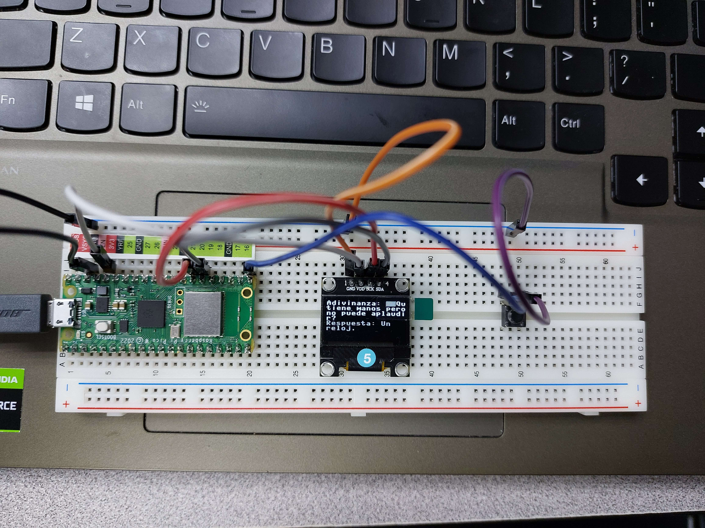

# Solución


# Codigo
```python
import json
import network
import urequests
from time import sleep
from machine import Pin, I2C
from ssd1306 import SSD1306_I2C
import urequests as requests
import ujson
import io

ssid = 'YOUR_SSID'
password = 'YOUR_PASSWORD'
open_ai_question = "Dime una adivinanza corta y su respuesta"
url = 'https://api.openai.com/v1/chat/completions'
apiKey = 'YOUR_API_KEY'
pix_res_x = 128
pix_res_y = 64
i2c = I2C(0, scl=Pin(21), sda=Pin(20))
oled = SSD1306_I2C(pix_res_x, pix_res_y, i2c)
Boton = Pin(16, Pin.IN, Pin.PULL_UP)

def connect():
    #Connect to WLAN
    wlan = network.WLAN(network.STA_IF)
    wlan.active(True)
    wlan.connect(ssid, password)

def makeRequest():
    payload ={
        "model": "gpt-3.5-turbo",
        "messages":[
            {
                "role": "user",
                "content": open_ai_question
            },
        ],
        "temperature": 1,
        "top_p": 1,
        "n": 1,
        "stream": False,
        "max_tokens": 100,
        "presence_penalty": 0,
        "frequency_penalty": 0
    }
    headers = {
        'Content-Type': 'application/json',
        'Accept': 'application/json',
        'Authorization': 'Bearer ' + apiKey
    }
    response = requests.post(url, headers=headers, data=json.dumps(payload))
    response_data = response.json()
    open_ai_message = response_data["choices"][0]["message"]["content"]
    response.close()

    oled.text(open_ai_message, 0, 0)
    oled.show()

    oled_response(open_ai_message)
    print(format_text(open_ai_message, 128//8))

def format_text(text, max_horizontal_chars):
    new_text = io.StringIO()
    current_lenght = 0

    for char in text:
        if current_lenght == 0 and char == " ":
            continue

        if current_lenght >= max_horizontal_chars:
            current_lenght = 0
            if char not in ("\n", " "):
                current_lenght += 1
            new_text.write("\n" + char.strip())
            continue

        new_text.write(char)
        current_lenght += 1

    return new_text.getvalue()

def oled_response(response):
    font_size = 8
    formatted_text = format_text(response, oled.width // font_size)

    oled.fill(0)
    for i, line in enumerate(formatted_text.splitlines()):
        x = 0
        y = i * font_size
        oled.text(line, x, y)
    try:
        oled.show()
    except OSError:
        print("Display error")

def main():
    connect()
    while True:
        if Boton.value() == 0:
            makeRequest()

if __name__ == '__main__':
    main()
```
