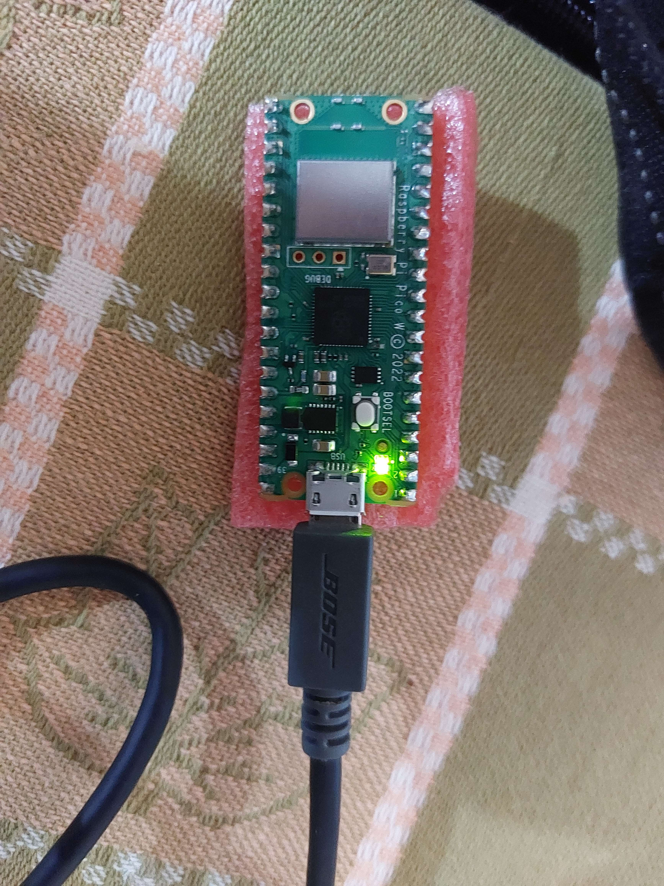
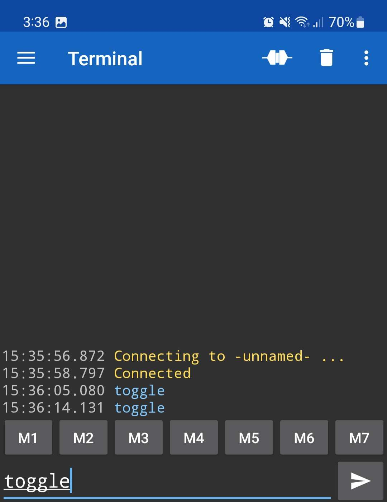
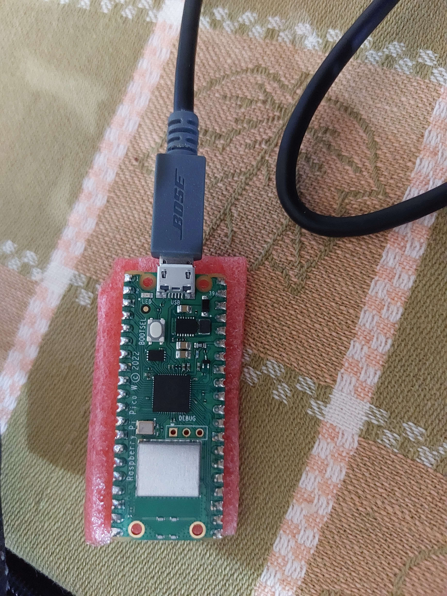

# Solución





# Codigo

Codigo principal
```python
from machine import Pin 
import bluetooth
from ble_simple_peripheral import BLESimplePeripheral

# Create a Bluetooth Low Energy (BLE) object
ble = bluetooth.BLE()

# Create an instance of the BLESimplePeripheral class with the BLE object
sp = BLESimplePeripheral(ble)

# Create a Pin object for the onboard LED, configure it as an output
led = Pin("LED", Pin.OUT)

# Initialize the LED state to 0 (off)
led_state = 0

# Define a callback function to handle received data
def on_rx(data):
    print("Data received: ", data)  # Print the received data
    global led_state  # Access the global variable led_state
    if data == b'toggle\r\n':  # Check if the received data is "toggle"
        led.value(not led_state)  # Toggle the LED state (on/off)
        led_state = 1 - led_state  # Update the LED state

# Start an infinite loop
while True:
    if sp.is_connected():  # Check if a BLE connection is established
        sp.on_write(on_rx)  # Set the callback function for data reception
```

Codigo auxiliar.
```python
from micropython import const
import struct
import bluetooth

# Advertising payloads are repeated packets of the following form:
#   1 byte data length (N + 1)
#   1 byte type (see constants below)
#   N bytes type-specific data

_ADV_TYPE_FLAGS = const(0x01)
_ADV_TYPE_NAME = const(0x09)
_ADV_TYPE_UUID16_COMPLETE = const(0x3)
_ADV_TYPE_UUID32_COMPLETE = const(0x5)
_ADV_TYPE_UUID128_COMPLETE = const(0x7)
_ADV_TYPE_UUID16_MORE = const(0x2)
_ADV_TYPE_UUID32_MORE = const(0x4)
_ADV_TYPE_UUID128_MORE = const(0x6)
_ADV_TYPE_APPEARANCE = const(0x19)


# Generate a payload to be passed to gap_advertise(adv_data=...).
def advertising_payload(limited_disc=False, br_edr=False, name=None, services=None, appearance=0):
    payload = bytearray()

    def _append(adv_type, value):
        nonlocal payload
        payload += struct.pack("BB", len(value) + 1, adv_type) + value

    _append(
        _ADV_TYPE_FLAGS,
        struct.pack("B", (0x01 if limited_disc else 0x02) + (0x18 if br_edr else 0x04)),
    )

    if name:
        _append(_ADV_TYPE_NAME, name)

    if services:
        for uuid in services:
            b = bytes(uuid)
            if len(b) == 2:
                _append(_ADV_TYPE_UUID16_COMPLETE, b)
            elif len(b) == 4:
                _append(_ADV_TYPE_UUID32_COMPLETE, b)
            elif len(b) == 16:
                _append(_ADV_TYPE_UUID128_COMPLETE, b)

    # See org.bluetooth.characteristic.gap.appearance.xml
    if appearance:
        _append(_ADV_TYPE_APPEARANCE, struct.pack("<h", appearance))

    return payload


def decode_field(payload, adv_type):
    i = 0
    result = []
    while i + 1 < len(payload):
        if payload[i + 1] == adv_type:
            result.append(payload[i + 2 : i + payload[i] + 1])
        i += 1 + payload[i]
    return result


def decode_name(payload):
    n = decode_field(payload, _ADV_TYPE_NAME)
    return str(n[0], "utf-8") if n else ""


def decode_services(payload):
    services = []
    for u in decode_field(payload, _ADV_TYPE_UUID16_COMPLETE):
        services.append(bluetooth.UUID(struct.unpack("<h", u)[0]))
    for u in decode_field(payload, _ADV_TYPE_UUID32_COMPLETE):
        services.append(bluetooth.UUID(struct.unpack("<d", u)[0]))
    for u in decode_field(payload, _ADV_TYPE_UUID128_COMPLETE):
        services.append(bluetooth.UUID(u))
    return services


def demo():
    payload = advertising_payload(
        name="micropython",
        services=[bluetooth.UUID(0x181A), bluetooth.UUID("6E400001-B5A3-F393-E0A9-E50E24DCCA9E")],
    )
    print(payload)
    print(decode_name(payload))
    print(decode_services(payload))


if __name__ == "__main__":
    demo()
```
Codigo auxiliar.
```python
import bluetooth
import random
import struct
import time
from ble_advertising import advertising_payload

from micropython import const

_IRQ_CENTRAL_CONNECT = const(1)
_IRQ_CENTRAL_DISCONNECT = const(2)
_IRQ_GATTS_WRITE = const(3)

_FLAG_READ = const(0x0002)
_FLAG_WRITE_NO_RESPONSE = const(0x0004)
_FLAG_WRITE = const(0x0008)
_FLAG_NOTIFY = const(0x0010)

_UART_UUID = bluetooth.UUID("6E400001-B5A3-F393-E0A9-E50E24DCCA9E")
_UART_TX = (
    bluetooth.UUID("6E400003-B5A3-F393-E0A9-E50E24DCCA9E"),
    _FLAG_READ | _FLAG_NOTIFY,
)
_UART_RX = (
    bluetooth.UUID("6E400002-B5A3-F393-E0A9-E50E24DCCA9E"),
    _FLAG_WRITE | _FLAG_WRITE_NO_RESPONSE,
)
_UART_SERVICE = (
    _UART_UUID,
    (_UART_TX, _UART_RX),
)


class BLESimplePeripheral:
    def __init__(self, ble, name="mpy-uart"):
        self._ble = ble
        self._ble.active(True)
        self._ble.irq(self._irq)
        ((self._handle_tx, self._handle_rx),) = self._ble.gatts_register_services((_UART_SERVICE,))
        self._connections = set()
        self._write_callback = None
        self._payload = advertising_payload(name=name, services=[_UART_UUID])
        self._advertise()

    def _irq(self, event, data):
        # Track connections so we can send notifications.
        if event == _IRQ_CENTRAL_CONNECT:
            conn_handle, _, _ = data
            print("New connection", conn_handle)
            self._connections.add(conn_handle)
        elif event == _IRQ_CENTRAL_DISCONNECT:
            conn_handle, _, _ = data
            print("Disconnected", conn_handle)
            self._connections.remove(conn_handle)
            # Start advertising again to allow a new connection.
            self._advertise()
        elif event == _IRQ_GATTS_WRITE:
            conn_handle, value_handle = data
            value = self._ble.gatts_read(value_handle)
            if value_handle == self._handle_rx and self._write_callback:
                self._write_callback(value)

    def send(self, data):
        for conn_handle in self._connections:
            self._ble.gatts_notify(conn_handle, self._handle_tx, data)

    def is_connected(self):
        return len(self._connections) > 0

    def _advertise(self, interval_us=500000):
        print("Starting advertising")
        self._ble.gap_advertise(interval_us, adv_data=self._payload)

    def on_write(self, callback):
        self._write_callback = callback


def demo():
    ble = bluetooth.BLE()
    p = BLESimplePeripheral(ble)

    def on_rx(v):
        print("RX", v)

    p.on_write(on_rx)

    i = 0
    while True:
        if p.is_connected():
            # Short burst of queued notifications.
            for _ in range(3):
                data = str(i) + "_"
                print("TX", data)
                p.send(data)
                i += 1
        time.sleep_ms(100)


if __name__ == "__main__":
    demo()
```
